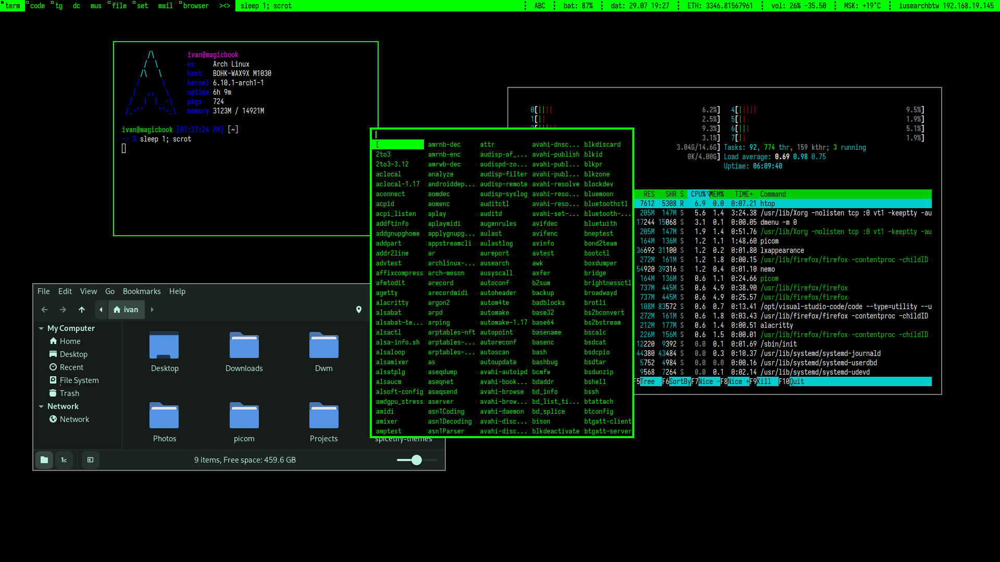

# Green N Black DWM - мой конфиг, цветовая схема которого содержит 3 цвета

### Что я использовал?
- [dwm](https://dwm.suckless.org/) вместе с:
    - [alwayscenter](https://dwm.suckless.org/patches/alwayscenter/) - все floating окна открываются в центре
    - [fullgaps](https://dwm.suckless.org/patches/fullgaps/) - пробелы между окнами 
    - [pertag](https://dwm.suckless.org/patches/pertag/) - на каждом workspace свои параметры для окон 
- [dmenu](https://tools.suckless.org/dmenu/) вместе с:
  - [alpha](https://tools.suckless.org/dmenu/patches/alpha/) - прозрачность
  - [border](https://tools.suckless.org/dmenu/patches/border/) - добавляет рамку
  - [center](https://tools.suckless.org/dmenu/patches/center/) - центрирует
  - [grid](https://tools.suckless.org/dmenu/patches/grid/) - делает все по строкам
  - [gridnav](https://tools.suckless.org/dmenu/patches/gridnav/) - разбивает строки на несколько частей
- [slock](https://tools.suckless.org/slock/) вместе с:
  - [blur](https://tools.suckless.org/slock/patches/blur-pixelated-screen/) - делает прозрачным экран при блокировке
- [dwmblocks](https://github.com/torrinfail/dwmblocks) для отрисовки статуса

### Какой софт я использую?
- [Visual Studio Code](https://code.visualstudio.com/) как основной редактор кода
- [Alacritty](https://alacritty.org) - терминал
- [Spotify](https://spotify.com) - сервис для прослушивания музыки
- [Telegram](https://telegram.org) - официальный клиент
- [Thunderbird](https://www.thunderbird.net/) - E-mail клиент
- Nemo - файловый менеджер

### Шрифты, темы и иконки
- [Iosevka Nerd Font](https://www.nerdfonts.com/) - шрифт всей системы и редакторов
- [Zorin](https://github.com/ZorinOS/zorin-desktop-themes) - тема
- [Papirus](https://github.com/PapirusDevelopmentTeam/papirus-icon-theme) - иконки 